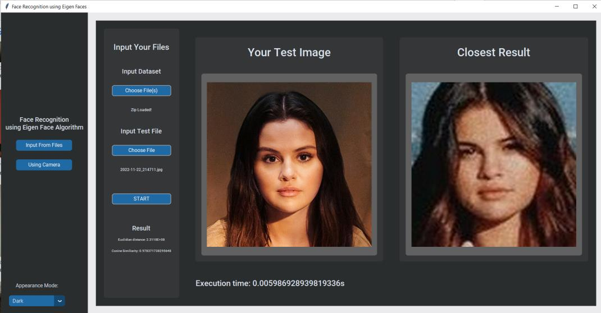

# Face Recognition using Eigenfaces - kom-Bi-Na-To-Ry

## Disusun Oleh
1. 13521067 - Yobel Dean Christoper
2. 13521131 - Jeremya Dharmawan Rahardjo
3. 13521162 - Antonio Natthan Krishna

# How To Run
1. Jalankan main.py
2. Program dapat dijalankan melalui input file dan melalui webcam

# Tampilan Aplikasi

### Dark Mode

### Light Mode

## Melalui input test image
1. Masukkan dataset
2. Masukkan input test-image
3. Tekan tombol start
4. Gambar terdekat akan muncul

## Melalui input test image

  

1. Masukkan dataset
2. Tekan tombol start
3. Gambar terdekat akan muncul

